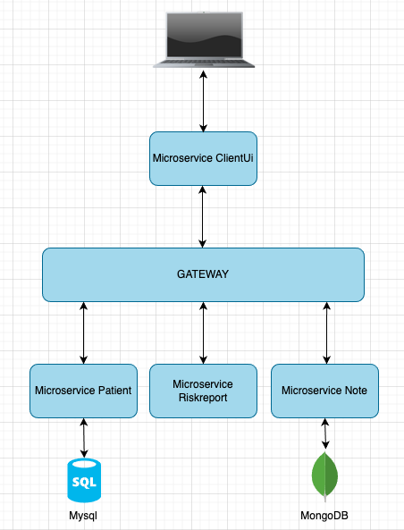
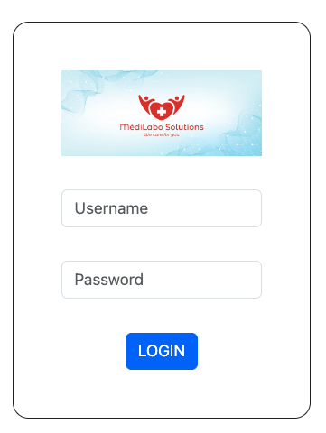
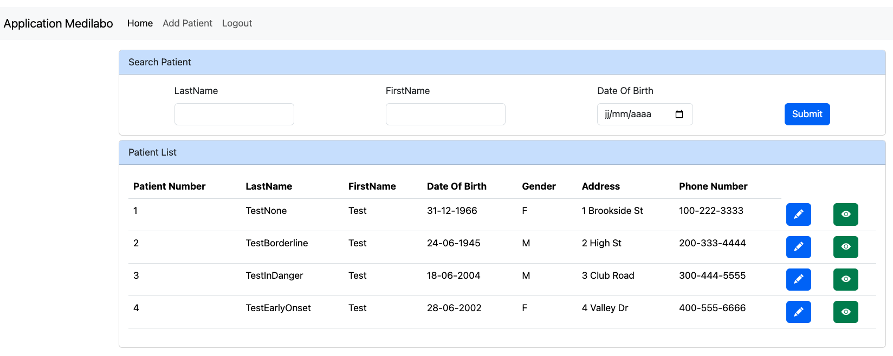
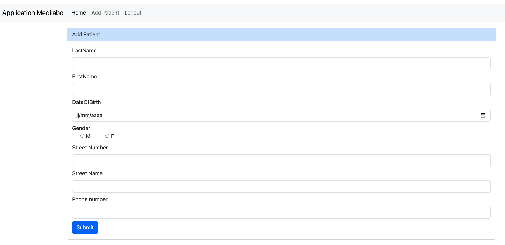
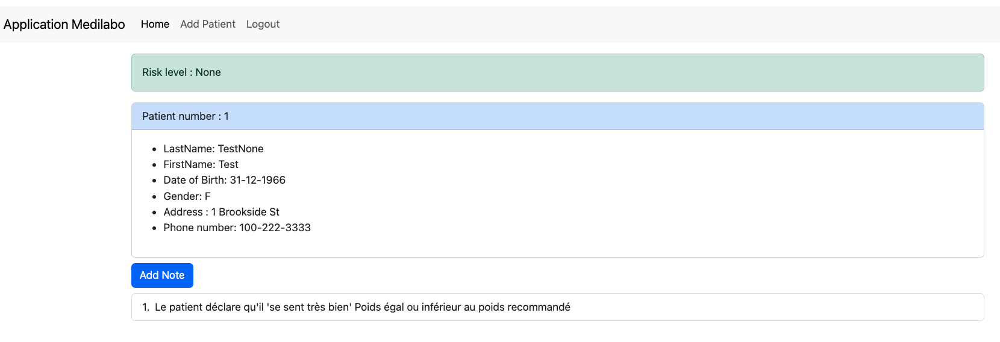
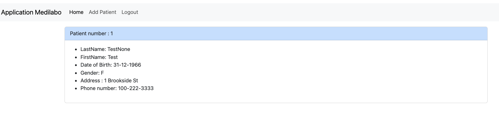

# MedilaboSolutions

Médilabo is a medical application. It allows users (secretary and doctor) to add patients and update patients' personal information.
As a doctor you can also add notes on each patient and consult them. Depending on the patient's sex, age and the number of trigger terms
present in the medical notes, an estimate of the risk of developing diabetes is calculated and displayed on the patient information page.

## Prerequisites
Before you begin, you need:
* Java 17
* Mysql 8.1
* MongoDb 7.0.11
* Docker (Optional)
* IDE like Intellij / Eclipse

## Conception
The MedilaboSolutions project is based on a microservices architecture. It consists of a frontend microservice developed with Thymeleaf, a gateway, as well as three backend microservices.

## Security
The project uses spring security. When the user successfully authenticates, a jwt token is generated and transmitted in the header of each request. The gateway and each microservice checks the validity of the token before providing the requested resources.

## Using MedilaboSolutions
* Clone the project
* Open it in your IDE
* In Intellij if the modules are not recognized as a maven project, right click on the pom.xml file of each module and click "Add as Maven project". Then in the Maven tab, click on “Reload all maven projects”
* In the Patient and Note microservices, update the application properties file with your credentials for connecting to your databases.
* Run each microservices or use docker-compose up command if you are using docker
* Databases are created and test data is inserted
* Type http://localhost:8080 in your browser
* Have fun

## Preview
* Login Page

* Home Page

* Add Patient Page

* Patient Info Page (View Medical Staff)

* Patient Info Page (View Administrative Staff)

## Green Code Suggestions
* Store the risk level rather than recalculating it each time you consult the patient's information. Only recalculate and update it if a new note is added.
* Improve the risk calculation algorithm.
* Do not display gender, address and telephone number on the home page since this information is visible on the patient information page.

## Area of Improvement
* Externalize configuration (Spring Cloud Config)
* Add a registry and discovery microservice (Eureka)
* Develop feature for deleting a patient
* Develop feature for updating and deleting a note
